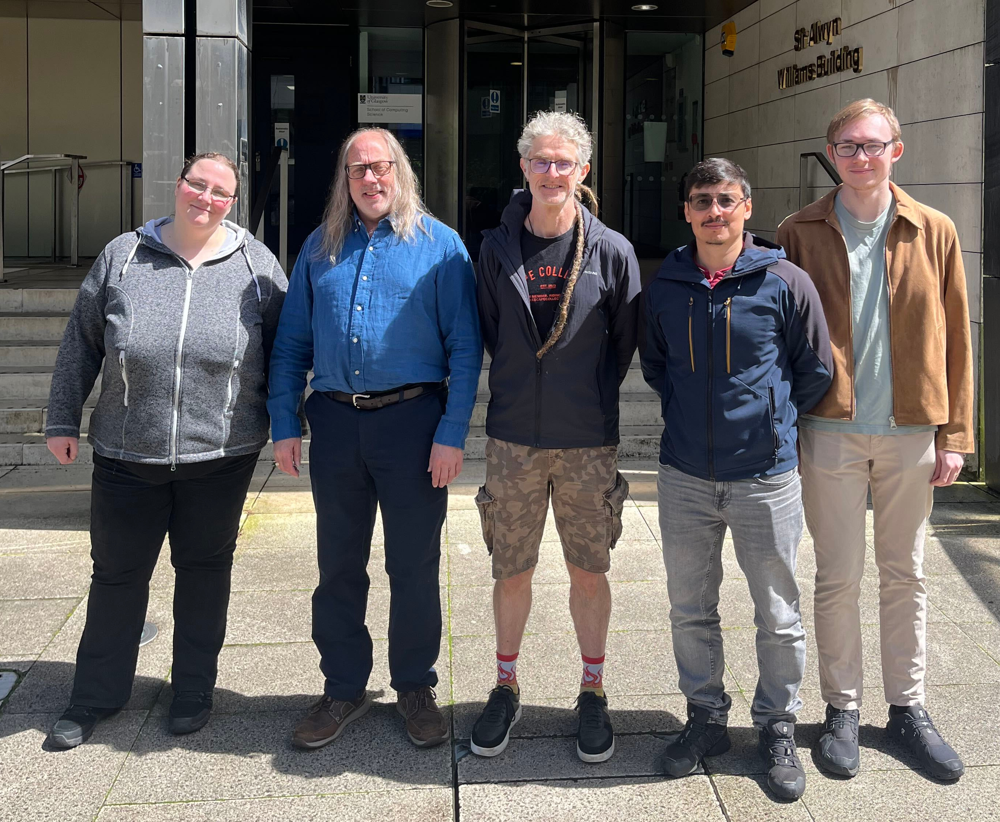

The project BodyElectric has officially started, funded by the European Research Council (ERC) under the European Union’s Horizon 2020 research and innovation programme (#101201656, BodyElectric) (01/06/2026).

