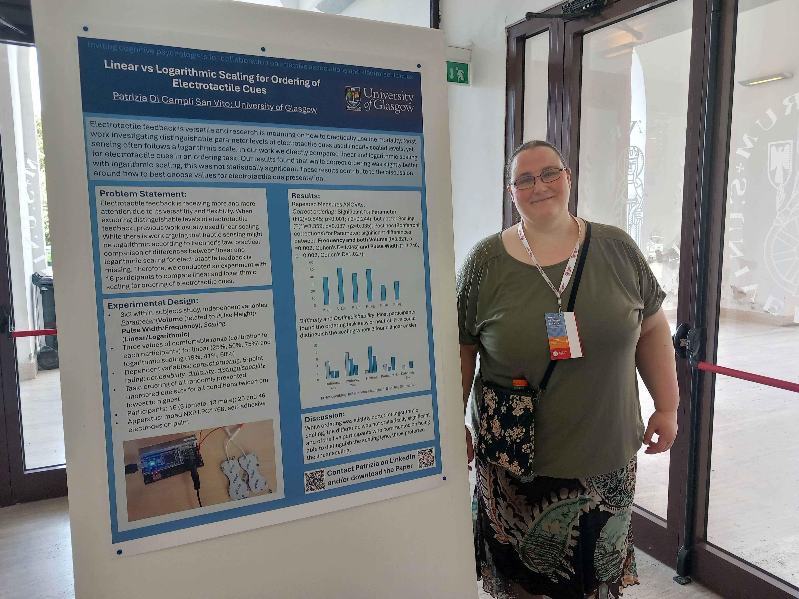

Andres and Patrizia have attended the EuroHaptics 2026 conference in Siena, Italy from the 6th to the 9th July. Patrizia has presented the work in progress paper <a href="https://zenodo.org/records/20286731">Linear vs Logarithmic Scaling for Ordering of Electrotactile Cues</a>.

