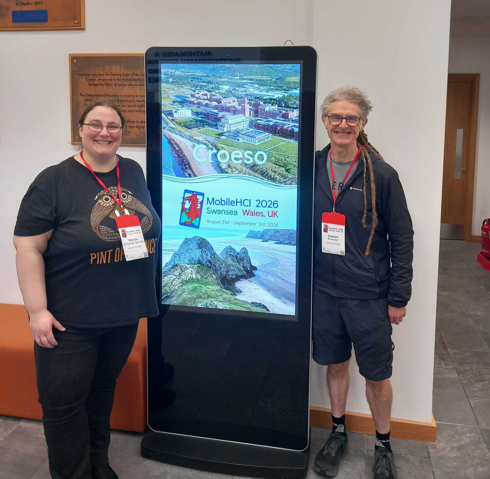

Stephen and Patrizia attended MobileHCI 2026 in Swansea, Wales from the 31th August to the 3rd September. Patrizia presented the TOCHI paper <a href="https://dl.acm.org/doi/10.1145/3797949">The Influence of Single Parameter Changes on Subjective Experience and Ordering Performance of Electrotactile Cues</a>.

